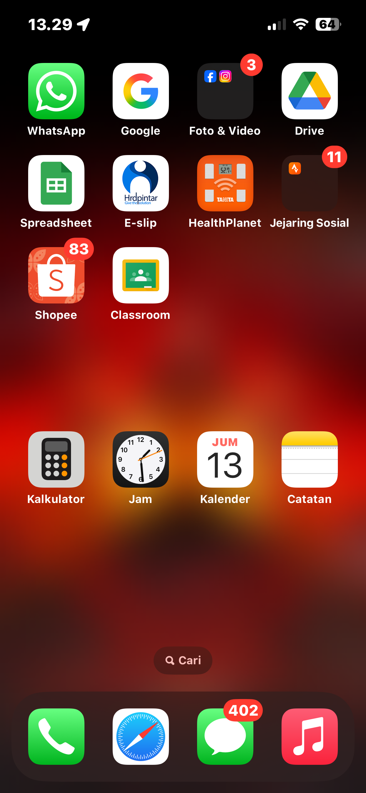

[index.html](https://github.com/user-attachments/files/25309647/index.html)
<!DOCTYPE html>
<html>
<head>
  <title>Website Lukman</title>
  
</head>
<body>

  <button onclick="tampilkanGambar()">Klik Disini</button>

   
  

  

</body>
</html>
